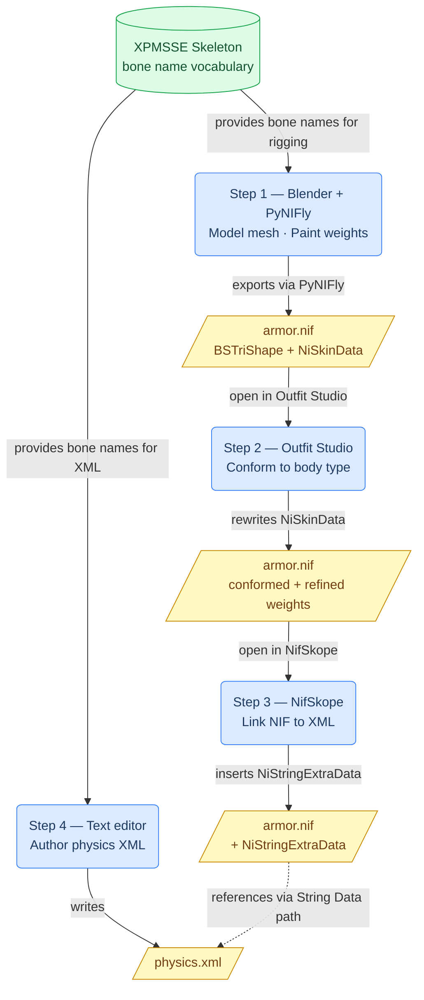

### Engineering Skinned Mesh Physics: A Technical Manual for Faster HDT-SMP

This manual covers the full pipeline for turning a static Skyrim mesh into a physics-simulated asset using **Faster HDT-SMP (FSMP)**. FSMP replaced the old Havok-based HDT-PE with the open-source **Bullet Physics** engine, adding multithreading and AVX support to spread the simulation load across CPU cores.

---

### Phase 1: Software Requirements

#### Sequential Workflow

The five tools below are used in order. Actions (rounded rectangles) produce or modify file deliverables (parallelograms). XPMSSE (cylinder) is a shared reference used at two points in the pipeline.



#### Tool Descriptions

1. **Blender (v3.6 or 4.0) + PyNIFly Plugin**

   - **Files edited:** Creates `armor.nif` with `BSTriShape` nodes (geometry, UVs, normals) and `NiSkinInstance` / `NiSkinData` / `NiSkinPartition` blocks encoding per-vertex bone weights. Also saves the working `.blend` file.
   - **What it brings:** The foundational authoring step — geometry modelling, proxy collision mesh construction, and bone weight painting. PyNIFly handles the Blender↔NIF round-trip correctly; older NifTools exporters routinely corrupt bone weight indices in `NiSkinPartition`, producing wrong skeleton references that are invisible until in-game testing.

2. **Outfit Studio**

   - **Files edited:** Rewrites the `NiSkinData` per-bone bind transforms and bounding spheres, and the `NiSkinPartition` per-vertex bone index + weight arrays in `armor.nif`. Can also copy weight maps from a reference body NIF.
   - **What it brings:** Body-preset compatibility. A mesh straight from Blender is rigged to the neutral reference pose and will clip or gap on morphed bodies (CBBE, 3BA, BHUNP, etc.). Outfit Studio conforms vertex positions to the target body shape and transfers production-quality skin weights, so the NIF deforms correctly across presets.

3. **NifSkope (v2.0 Pre-Alpha 3)**

   - **Files edited:** Adds a `NiStringExtraData` block to the Scene Root NiNode's **Extra Data List** in `armor.nif`. The block's **Name** must be `HDT Skinned Mesh Physics Object` (case-sensitive) and its **String Data** must be the Skyrim-root-relative path to the physics XML (e.g. `SKSE\Plugins\hdtSkinnedMeshConfigs\MyMod.xml`).
   - **What it brings:** The critical NIF↔XML link (see Phase 5, Link 1). Without this block FSMP falls back to `defaultBBPs.xml` name-matching. NifSkope also lets you inspect `BSTriShape` node names to verify they match the `name` attributes in your XML.

4. **Text / XML Editor**

   - **Files edited:** Creates `physics.xml` (or whichever filename is referenced in the NIF). Contains the `<system>` root, `<bone>`, `<generic-constraint>`, and `<per-vertex-shape>` / `<per-triangle-shape>` elements.
   - **What it brings:** The physics brain — defines mass, damping, collision margins, angular limits, and constraint ranges for every simulated bone and shape. No XML means no simulation, regardless of how the NIF is set up.

5. **XP32 Maximum Skeleton Extended (XPMSSE)**

   - **Files provided:** Skeleton NIFs at `meshes\actors\character\character assets\skeleton.nif` (and related actor paths), each containing a tree of `NiNode` objects whose `.name` fields are the canonical bone vocabulary.
   - **What it brings:** A shared bone name contract between the NIF and the XML. Both the `<bone name="...">` attributes in `physics.xml` and the bone weight maps baked into `NiSkinData` must reference names present in the active runtime skeleton. XPMSSE extends the vanilla Bethesda skeleton with the extra nodes (breast, belly, butt, hair chain, cloak) that FSMP needs to simulate cloth and soft-body physics.

---

### Phase 2: Geometric Design and Optimization

Physics performance scales directly with vertex and triangle count in collision tests. Never simulate the high-resolution visual mesh directly — this causes severe FPS drops.

#### The Proxy Mesh Protocol

Use a **proxy mesh** — a low-poly version of the object used only for collision simulation. The visual mesh is weight-painted to follow the proxy's bones, so it deforms visually while only the cheap proxy is simulated.

- **Topology:** Model in Blender using only **triangles or quads**. PyNIFly triangulates quads automatically on NIF export, so FSMP and the NIF format itself only ever process triangles (`BSTriShape` = triangle-only). N-gons (5+ sided polygons) cannot be safely triangulated and will cause visual artifacts or export failures — avoid them entirely.
- **Vertex density:** A simple cape needs few points. Complex layered skirts need more, but stay within vanilla polycounts for collision assets.

---

### Phase 3: Rigging and Skeletal Hierarchy

For physics, bones are physical entities with mass and inertia, not just deformation handles.

#### Kinematic vs. Dynamic Bones

- **Kinematic Bones:** `<mass>0</mass>` in the XML. They track the game's predefined animations (e.g. pelvis, spine) and act as fixed **anchor points**.
- **Dynamic Bones:** Mass > 0. Their position and rotation are computed each frame by the Bullet engine from gravity, inertia, and collisions.

#### Weight Painting

Every vertex must be weighted to at least one bone. An unweighted vertex has no parent reference and snaps to world origin (0, 0, 0) — this is the most common cause of "melting" or infinite-stretch artefacts.

---

### Phase 4: XML Logic Configuration

The XML file defines how each bone and shape responds to forces.

#### Key Tags

- **`<mass>`:** Bone weight in kg. Set to `0` for kinematic anchor bones.

- **`<inertia>`:** Inverse scale factor on the bone's local inertia tensor. Defaults to `0` (skips inertia calculation). **Set to `1`** for physically realistic behaviour. Values below 1 increase effective inertia; values above 1 decrease it.

- **`<linearDamping>` / `<angularDamping>`:** Energy dissipation per physics step, range 0–1. Both default to `0`. `linearDamping` on bones is a blunt per-step velocity cut — leave it at 0 on bones and use it on constraints instead. `angularDamping` damps rotation via `ω *= (1 − d)^Δt`. Tune these to reduce bouncing without killing motion.

- **`<margin>`:** Inflates the Bullet collision shape boundary. Defaults to `1`. Larger values improve stability but can make objects float; smaller values risk tunnelling.

- **`<restitution>`:** Bounciness. Defaults to `0`.

#### Constraints (Generic 6DOF)

Constraints cap how far bones can stretch or twist.

- **Linear Limits** (`<linearLowerLimit>` / `<linearUpperLimit>`): Default `(1,1,1)` / `(-1,-1,-1)`. Because the lower limit exceeds the upper limit, **no linear constraint is enforced by default** — intentional, not a bug. To prevent rubber-band stretching, set both to `(0,0,0)` to lock all axes, or use small symmetrical values for minimal give.

- **Angular Limits** (`<angularLowerLimit>` / `<angularUpperLimit>`): Set the "feel" of the material. Leather: ±0.2 rad; lightweight cloth: ±1.57 rad (90°).

---

### Phase 5: How FSMP Links the NIF to the XML

FSMP links a NIF to its physics XML through a chain of mechanisms executed at runtime when the armor is equipped. All of them must be understood for authoring and debugging.

#### Link 1 — Primary trigger: `NiStringExtraData` in the NIF

FSMP scans every block in the NIF's **Extra Data List** for a `NiStringExtraData` entry whose **Name** is exactly:

```
HDT Skinned Mesh Physics Object
```

(case-sensitive, `hdtDefaultBBP.cpp → DefaultBBP::scanBBP`).

If found with a non-empty **String Data**, that value is used verbatim as the XML file path (Skyrim-root-relative):

```
SKSE\Plugins\hdtSkinnedMeshConfigs\MyMod.xml
```

**NifSkope setup:**

1. Right-click the **Scene Root** NiNode → `Block > Insert` → `NiStringExtraData`.
2. Set **Name** to exactly `HDT Skinned Mesh Physics Object`.
3. Set **String Data** to the XML path.
4. Confirm the block's index appears in the Scene Root's **Extra Data List**.

> ⚠️ An empty **String Data** triggers the fallback below — FSMP does **not** reuse any previously loaded XML.

#### Link 2 — Fallback: `defaultBBPs.xml` shape-name matching

If no valid `NiStringExtraData` is found, FSMP checks `SKSE\Plugins\hdtSkinnedMeshConfigs\defaultBBPs.xml`, which maps NIF mesh names to XML files:

```xml
<map shape="SomeMeshName" file="SKSE\Plugins\hdtSkinnedMeshConfigs\SomeFile.xml"/>
```

FSMP collects the names of all direct `BSTriShape` children of the armor node and checks for a matching `shape` attribute. First match wins. This allows physics to be applied without touching the NIF at all — useful for vanilla or third-party meshes.

`defaultBBPs.xml` also supports `<remap>` entries to resolve one canonical name from multiple alternative mesh names with priority ordering.

#### Link 3 — XML root: `<system>`

FSMP immediately checks that the root element of the XML is `<system>`. Any other root name rejects the file entirely:

```xml
<system>
  <!-- bone and shape definitions go here -->
</system>
```

#### Link 4 — `<bone name="...">` → skeleton node lookup

Each `<bone>` name is looked up in the **NPC skeleton** (not the armor NIF) via `findNode(skeleton, name)` — exact, case-sensitive match.

```xml
<bone name="NPC Spine1 [Spn1]">
  <mass>0</mass>
</bone>
```

An unmatched name is skipped with a warning. When an armor is equipped, FSMP prefixes all bone names internally to avoid conflicts between multiple equipped items; a rename map handles this transparently — you never write the prefix in the XML.

#### Link 5 — `<per-vertex-shape>` / `<per-triangle-shape>` → NIF mesh lookup

These elements define a collision body from NIF geometry. The `name` attribute is matched against `BSTriShape` nodes in the **armor NIF** via `findObject(armorModel, name)` — exact match.

```xml
<per-vertex-shape name="SomeMeshName">
  <margin>1</margin>
</per-vertex-shape>
```

No matching mesh → shape silently skipped, no collision body created.

With `defaultBBPs.xml` remapping active (Link 2), the name is resolved through the remap table first, allowing one `<per-vertex-shape>` to aggregate geometry from several NIF meshes into a single collision body.

#### Link 6 — Implicit bone creation from `NiSkinData`

When processing a collision shape (Link 5), FSMP reads `NiSkinData` / `NiSkinPartition` for vertex positions and per-vertex bone weights. For each referenced bone, FSMP checks whether a matching `<bone>` was declared in the XML (Link 4).

If not declared, the bone is auto-created as a kinematic anchor with default parameters. You therefore only need to declare bones whose physics you want to customise.

#### Link 7 — Constraint bone references: `bodyA` / `bodyB`

Constraints reference bones by name:

```xml
<generic-constraint bodyA="NPC Spine1 [Spn1]" bodyB="NPC Spine2 [Spn2]">
  ...
</generic-constraint>
```

Names are resolved against all created bones (explicit or implicit). Unresolvable names cause the constraint to be skipped. Constraints between two kinematic bones are silently discarded.

#### Link 8 — Collision filtering: `can-collide-with-bone` / `no-collide-with-bone`

Inside `<bone>` or `<per-vertex-shape>` / `<per-triangle-shape>`, per-body collision filtering uses the same name-lookup as Link 7:

```xml
<per-vertex-shape name="SkirtFront">
  <no-collide-with-bone>NPC L Thigh [LThg]</no-collide-with-bone>
  <can-collide-with-bone>NPC Pelvis [Pelv]</can-collide-with-bone>
</per-vertex-shape>
```

Referenced names must be valid skeleton nodes or previously declared `<bone>` elements.

#### Summary diagram

```
NIF File                            XML File
─────────────────────────────────   ──────────────────────────────────────
NiStringExtraData                   <system>
  Name = "HDT Skinned Mesh          │
          Physics Object"   ──────► │  <bone name="...">  ──► NIF skeleton node (by name)
  String Data = "path/to/xml"       │  </bone>
                                    │
BSTriShape "SomeName"      ◄─────── │  <per-vertex-shape name="SomeName">
  NiSkinData                        │    <no-collide-with-bone>...</no-collide-with-bone>
    bone[0] = "NPC Spine1..." ─────►│  </per-vertex-shape>
    bone[1] = "NPC L Thigh..." ────►│
                                    │  <generic-constraint
                                    │    bodyA="NPC Spine1..."  ──► declared/implicit bone
                                    │    bodyB="NPC Spine2..."> ──► declared/implicit bone
                                    │  </generic-constraint>
                                    │</system>
                                    │
defaultBBPs.xml (fallback)          │
  <map shape="SomeName"    ────────►│
       file="path/to/xml"/>
```

---

### Phase 6: Troubleshooting and Debugging

#### Common Visual Glitches

- **Melting/Stretching:** Usually unweighted vertices (see Phase 3). If weights are correct, look for an unstable simulation: reduce `<angularStiffness>` and `<linearStiffness>`, or raise `<angularDamping>` and `<linearDamping>` on the relevant constraints. If all characters are affected, increase `maxSubSteps` or raise `min-fps` in `configs.xml` to give the physics engine more substep resolution.

  > ⚠️ `<hkparam name="maxLinearVelocity">` is **HDT-PE (Havok) syntax** — it has no effect in FSMP, which uses Bullet Physics.

- **Invisible Meshes:** Usually a DLL version mismatch for your Skyrim executable (SE vs. AE).

- **Jumping/Flapping:** Damping values too low or constraints too loose.

#### Console Commands

- **`smp reset`:** Reloads XML configs and reinitialises the physics world. Use to apply changes without restarting.
- **`smp list`:** Lists all tracked skeletons and their active/inactive state.
- **`smp detail`:** Like `smp list`, plus each tracked armor addon and head part with physics status and active collision meshes.
- **`smp on` / `smp off`:** Enables or disables FSMP physics globally at runtime.

  > ⚠️ There is no `smp timing` command in FSMP (it existed in legacy HDT-SMP). For performance analysis, enable `autoAdjustMaxSkeletons` and set `logLevel` to `4` (debug) in `configs.xml`.
