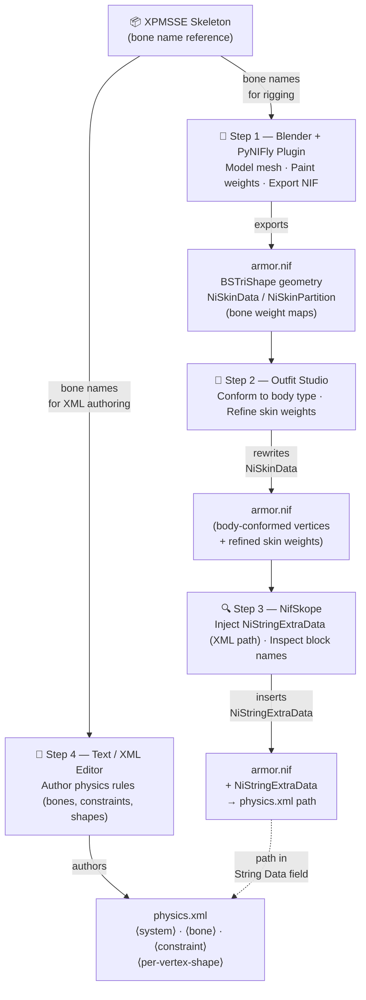

### Engineering Skinned Mesh Physics: A Technical Manual for Faster HDT-SMP

This manual provides a comprehensive protocol for transforming static Skyrim objects into dynamically simulated assets using the **Faster HDT-SMP (FSMP)** framework. This guide emphasizes the balance between high-fidelity simulation and computational performance.

---

### Phase 1: Foundations and Software Requirements

The transition from the legacy **HDT Physics Extension (HDT-PE)** to **HDT-SMP** marked a shift from the integrated Havok engine to the open-source **Bullet Physics** engine. Unlike Havok, which Bethesda restricted to basic environmental collisions, Bullet allows for complex, real-time deformation of cloth, hair, and soft bodies. **Faster HDT-SMP** further optimizes this by introducing multithreading and Advanced Vector Extensions (AVX), distributing the physics load across multiple CPU cores rather than bottlenecking a single thread.

#### Required Toolkit — Sequential Workflow

Each tool occupies a distinct, ordered step in the authoring pipeline. The diagram below shows which files flow between tools and where the physics XML fits in:



#### Tool Descriptions

1. **Blender (Version 3.6 or 4.0 recommended)**

   - **Files created / edited:** Your source `.blend` project, and via the PyNIFly export pipeline, the output `armor.nif`. Inside the NIF, Blender populates `BSTriShape` nodes (mesh geometry, UV maps, normals) and creates the `NiSkinInstance` / `NiSkinData` / `NiSkinPartition` blocks that record which skeleton bones each vertex is weighted to and by how much.
   - **What it brings to the process:** This is the foundational authoring step. Blender is where the visual mesh is modeled, the low-poly proxy collision mesh is built, and every vertex is painted with bone weights. The quality of the weight painting here determines whether the physics simulation will deform the mesh correctly or produce stretching, tearing, and melting artifacts in-game.

2. **PyNIFly Plugin**

   - **Files created / edited:** Acts as Blender's NIF import/export bridge, directly reading and writing `BSTriShape`, `NiSkinData`, and `NiSkinPartition` blocks in `armor.nif` without corrupting bone weight indices or bone-to-vertex mappings — a known failure mode of older NifTools exporters.
   - **What it brings to the process:** Reliable round-tripping between the `.blend` working file and the binary `.nif` format. Without PyNIFly, bone weight indices stored in `NiSkinPartition` are routinely remapped incorrectly on export, producing meshes whose skin data references the wrong skeleton nodes — leading to physics failures or broken deformation that is invisible until in-game testing.

3. **Outfit Studio**

   - **Files created / edited:** The `armor.nif` produced by Blender. Outfit Studio rewrites the `NiSkinData` per-bone bind transforms and bounding spheres, and the `NiSkinPartition` per-vertex bone index + weight arrays, to conform the mesh to a specific body preset morph. It can also copy weight maps directly from a reference body NIF.
   - **What it brings to the process:** Body-type compatibility. A mesh exported from Blender is rigged to the neutral reference pose and will clip or gap when worn over a body that has been morphed to a different preset (CBBE, 3BA, BHUNP, etc.). Outfit Studio conforms the vertex positions to the target body shape and transfers production-quality skin weights from the body mesh to the armor where appropriate, ensuring the final NIF will deform correctly across body presets.

4. **NifSkope (Version 2.0 Pre-Alpha 3)**

   - **Files created / edited:** The `armor.nif`. NifSkope adds a `NiStringExtraData` block to the Scene Root NiNode's **Extra Data List**. The block's **Name** field must be set to exactly `HDT Skinned Mesh Physics Object` (case-sensitive) and its **String Data** field to the Skyrim-root-relative path of the physics XML (e.g. `SKSE\Plugins\hdtSkinnedMeshConfigs\MyMod.xml`). NifSkope also exposes the internal names of `BSTriShape` nodes so you can verify they match the `name` attributes used in your XML.
   - **What it brings to the process:** The critical NIF↔XML link (see Phase 5, Link 1). Without this block, FSMP cannot find the physics XML for this armor and falls back to the `defaultBBPs.xml` name-matching mechanism. NifSkope is also the primary inspection tool for confirming that mesh node names, bone references, and Extra Data block indices are all correctly structured before the mod is packaged.

5. **XP32 Maximum Skeleton Extended (XPMSSE)**

   - **Files provided:** A set of skeleton NIF files installed to `meshes\actors\character\character assets\skeleton.nif` (and related actor paths). Each file contains a tree of `NiNode` objects whose `.name` fields define the canonical bone name vocabulary that every Skyrim physics mod must use.
   - **What it brings to the process:** A shared bone name contract between the NIF and the XML. The `<bone name="...">` attributes in your physics XML and the bone weight maps baked into `NiSkinData` by Blender must both reference names that exist in the active skeleton at runtime. XPMSSE is the de-facto standard physics skeleton for Skyrim SE and provides the additional nodes beyond the vanilla Bethesda skeleton — breast, belly, butt, hair chain, and cloak bones — that FSMP requires to simulate cloth and soft-body physics.

---

### Phase 2: Geometric Design and Optimization

Performance in FSMP is directly correlated to the number of vertices and triangles involved in collision tests. Direct simulation of a high-resolution visual mesh is a fundamental error that leads to massive FPS drops.

#### The Proxy Mesh Protocol

To maintain 60 FPS, use a **proxy mesh**—a low-resolution version of the object used only for simulation.

- **Separation of Concerns:** The high-detail visual mesh is "weighted" to follow the movement of the low-detail proxy mesh.
- **Topology:** Meshes must strictly consist of **triangles or quadrilaterals**. Complex polygons (n-gons) cause calculation failures and visual artifacts during export.
- **Vertex Density:** For a simple cape, use a low density of points. For complex multi-layered skirts, use a medium density, but avoid exceeding vanilla polycounts for collision assets.

---

### Phase 3: Rigging and Skeletal Hierarchy

Rigging for physics differs from standard animation. Bones are not just deformation handles; they are physical entities with mass and inertia.

#### Kinematic vs. Dynamic Bones

- **Kinematic Bones:** These have a **mass of 0** in the XML configuration. They follow the game's predefined animations (e.g., the pelvis or spine) and serve as fixed **anchor points**.
- **Dynamic Bones:** These are the "beads" on the chain. Their position and rotation are calculated in real-time by the Bullet engine based on gravity, inertia, and collisions.

#### Weight Painting Essentials

Every vertex must be influenced by at least one bone. If a vertex is "unweighted," it lacks a parent reference and will "fall" to the world center (0,0,0). This is the most common cause of "melting" or infinite stretching where the mesh appears to be pulled into the ground.

---

### Phase 4: XML Logic Configuration

The XML file is the brain of the simulation. It defines how the object responds to forces.

#### Crucial Tag Definitions

- **`<mass>`:** Sets the "weight" of the bone. An anchor bone must be 0.

- **`<inertia>`:** An inverse scale factor applied to the bone's local inertia tensor. The default is 0, which skips inertia calculation entirely. **Strongly recommended: set to 1** for physically realistic behavior. Values below 1 increase the effective inertia; values above 1 decrease it. Setting it to 0 does not crash the simulation — it simply omits the inertia contribution.

- **`<linearDamping>` and `<angularDamping>`:** Damping coefficients between 0 and 1 that dissipate kinetic energy each physics step. Both default to **0**. `linearDamping` on bones is a blunt per-step velocity reduction and is recommended to remain at 0 on bones; it is more useful when applied to constraints. `angularDamping` reduces rotational velocity using the formula `angularVelocity *= pow(1 - angularDamping, timeStep)`. Tune these values carefully to reduce bouncing and jitter without over-damping the motion.

- **`<margin>`:** A positive floating-point value that inflates the collision shape boundary used by the Bullet Physics engine. Defaults to **1**. A larger margin makes collision detection more stable but can cause objects to appear to float slightly above surfaces. Values that are too small increase the risk of tunneling (objects passing through each other).

- **`<restitution>`:** Controls bounciness. Defaults to 0. Higher values make the object more elastic.

#### Constraints (Generic 6DOF)

Constraints limit how far bones can twist or stretch.

- **Linear Limits** (`<linearLowerLimit>` / `<linearUpperLimit>`): These default to `(1, 1, 1)` and `(-1, -1, -1)` respectively. Because the lower limit is greater than the upper limit, **no linear constraint is applied by default** — this is intentional, not a bug. To prevent fabric from stretching like rubber, explicitly set both limits to `(0, 0, 0)` to lock all linear axes, or use small symmetrical values to permit minimal stretch.

- **Angular Limits** (`<angularLowerLimit>` / `<angularUpperLimit>`): Define the "feel" of the material. Leather requires tight limits (e.g., ±0.2 radians), while lightweight cloth can allow rotations over 90 degrees (±1.57 radians).

---

### Phase 5: How FSMP Links the NIF to the XML

FSMP establishes the link between a NIF file and its physics XML through several distinct mechanisms, which are executed in sequence by the engine at runtime. Understanding all of them is essential for both authoring and debugging.

#### Link 1 — The primary trigger: `NiStringExtraData` embedded in the NIF

The first thing FSMP does when a piece of armor is equipped is scan every block in the NIF's **Extra Data List** for a `NiStringExtraData` entry whose **Name** field is exactly:

```
HDT Skinned Mesh Physics Object
```

(case-sensitive, checked in `hdtDefaultBBP.cpp → DefaultBBP::scanBBP`).

If such a block is found and its **String Data** value is non-empty, that value is used verbatim as the file path to the physics XML. The path is relative to the Skyrim root directory, so it typically looks like:

```
SKSE\Plugins\hdtSkinnedMeshConfigs\MyMod.xml
```

**How to set it up in NifSkope:**

1. Open the NIF and right-click the **Scene Root** NiNode → `Block > Insert` → choose `NiStringExtraData`.
2. Set the **Name** field to exactly `HDT Skinned Mesh Physics Object`.
3. Set the **String Data** field to the path of your XML file.
4. Make sure the new block's index appears in the **Extra Data List** of the Scene Root NiNode.

> ⚠️ If the `NiStringExtraData` block exists but has an empty `String Data` value, FSMP falls through to the fallback mechanism described next. It does **not** silently use any previously loaded XML.

#### Link 2 — The fallback: `defaultBBPs.xml` shape-name matching

If no `NiStringExtraData` block is found (or it has an empty value), FSMP falls back to `defaultBBPs.xml` (`SKSE\Plugins\hdtSkinnedMeshConfigs\defaultBBPs.xml`). This file maps **NIF mesh names** to XML files:

```xml
<map shape="SomeMeshName" file="SKSE\Plugins\hdtSkinnedMeshConfigs\SomeFile.xml"/>
```

FSMP collects the names of all direct `BSTriShape` children of the armor node, then checks whether any of those names appear as a `shape` attribute in `defaultBBPs.xml`. The first match wins and provides the XML path. This mechanism allows physics to be applied to a NIF without modifying it at all — useful for vanilla meshes or meshes from mods you do not control.

The `defaultBBPs.xml` also supports `<remap>` entries, which allow one canonical shape name to be resolved from several alternative actual mesh names with priority ordering.

#### Link 3 — The XML root: the `<system>` element

Once FSMP has a file path, it reads the XML and immediately checks that the root element is `<system>`. If the root has any other name, the file is rejected entirely and no physics is created. Every physics XML file must therefore look like:

```xml
<system>
  <!-- bone and shape definitions go here -->
</system>
```

#### Link 4 — `<bone name="...">` → NIF skeleton node lookup

Inside `<system>`, each `<bone>` element has a **`name` attribute**. This name is used to look up a node in the **NPC skeleton** (not the armor NIF) by calling `findNode(skeleton, name)`. The match must be **exact and case-sensitive**.

```xml
<bone name="NPC Spine1 [Spn1]">
  <mass>0</mass>
</bone>
```

If no skeleton node with that name exists, the bone is skipped with a warning and no rigid body is created. This means every bone name in your XML must correspond to an actual node name in the XPMSSE skeleton (or a custom skeleton your mod requires).

When an armor is equipped, FSMP merges the armor's bone nodes into the NPC skeleton under a unique prefix to avoid collisions between multiple equipped items. A **rename map** is passed to the XML parser so that bone name lookups are automatically adjusted to the prefixed names. You never need to embed the prefix in the XML — it is invisible at authoring time.

#### Link 5 — `<per-vertex-shape name="...">` / `<per-triangle-shape name="...">` → NIF mesh lookup

These elements define a collision body by reading vertex and triangle data directly from the NIF. The **`name` attribute** is used to look up a `BSTriShape` node inside the **armor NIF model** (not the skeleton) by calling `findObject(armorModel, name)`.

```xml
<per-vertex-shape name="SomeMeshName">
  <margin>1</margin>
</per-vertex-shape>
```

The name must match the internal name of a `BSTriShape` node in your NIF file exactly. If no such mesh is found, the shape is silently skipped and no collision body is created for it.

If `defaultBBPs.xml` remapping is in effect (Link 2), the name is first looked up in the remap table; if found, the set of actual NIF mesh names it maps to is used instead of the literal name. This allows one `<per-vertex-shape>` to aggregate geometry from several NIF meshes into a single collision body.

#### Link 6 — Implicit bone creation from `NiSkinData` (vertex bone weights)

When FSMP processes a collision shape (Link 5), it reads the mesh's **`NiSkinData`** and **`NiSkinPartition`** blocks to extract vertex positions and per-vertex bone weights. For each bone referenced in `NiSkinData`, FSMP looks up whether a `<bone>` with that name was already declared in the XML (Link 4).

If a bone referenced by the skin data was **not** declared in the XML, FSMP automatically creates it with default physics parameters (kinematic, no collision shape). This means your XML only needs to declare bones whose physics parameters you want to customise. All other bones that the mesh is weighted to are implicitly created and treated as pass-through kinematic anchors.

#### Link 7 — Constraint bone references: `bodyA` / `bodyB` attributes

Constraints (generic, stiffspring, conetwist) connect two bones by name using `bodyA` and `bodyB` attributes:

```xml
<generic-constraint bodyA="NPC Spine1 [Spn1]" bodyB="NPC Spine2 [Spn2]">
  ...
</generic-constraint>
```

FSMP resolves each name against the set of bones already created (either explicitly via `<bone>` or implicitly via skin data). If a name cannot be resolved and cannot be auto-created from the skeleton, the constraint is skipped. Constraints between two kinematic bones are also silently discarded, since neither can move.

#### Link 8 — Collision filtering: `can-collide-with-bone` / `no-collide-with-bone`

Inside both `<bone>` and `<per-vertex-shape>` / `<per-triangle-shape>`, FSMP supports per-body collision filtering by bone name:

```xml
<per-vertex-shape name="SkirtFront">
  <no-collide-with-bone>NPC L Thigh [LThg]</no-collide-with-bone>
  <can-collide-with-bone>NPC Pelvis [Pelv]</can-collide-with-bone>
</per-vertex-shape>
```

These strings are resolved at parse time through the same name-lookup mechanism as constraints (Link 7). Any bone name referenced here must be a valid NIF skeleton node or must have already been declared as a `<bone>` element earlier in the XML.

#### Summary diagram

```
NIF File                            XML File
─────────────────────────────────   ──────────────────────────────────────
NiStringExtraData                   <system>
  Name = "HDT Skinned Mesh          │
          Physics Object"   ──────► │  <bone name="...">  ──► NIF skeleton node (by name)
  String Data = "path/to/xml"       │  </bone>
                                    │
BSTriShape "SomeName"      ◄─────── │  <per-vertex-shape name="SomeName">
  NiSkinData                        │    <no-collide-with-bone>...</no-collide-with-bone>
    bone[0] = "NPC Spine1..." ─────►│  </per-vertex-shape>
    bone[1] = "NPC L Thigh..." ────►│
                                    │  <generic-constraint
                                    │    bodyA="NPC Spine1..."  ──► declared/implicit bone
                                    │    bodyB="NPC Spine2..."> ──► declared/implicit bone
                                    │  </generic-constraint>
                                    │</system>
                                    │
defaultBBPs.xml (fallback)          │
  <map shape="SomeName"    ────────►│
       file="path/to/xml"/>
```

---

### Phase 6: Performance Optimization

Faster HDT-SMP provides advanced software-level optimizations to maintain fluidity in complex scenes.

#### CPU and Instruction Sets

The FSMP plugin is compiled in different versions. Choose the one that matches your CPU's capabilities:

- **AVX2:** Standard for Intel Haswell/AMD Ryzen and newer. Provides a major performance boost.
- **AVX512:** Performance peak for modern high-end processors (AMD Ryzen 7000 series, Intel Sapphire Rapids and newer).
- **CUDA:** Currently in development, it offloads collision math to the GPU. It is most effective on systems with many actors and a powerful NVIDIA card, but may be less stable than CPU-based simulation.

#### Culling and Distance Management

Edit the global `configs.xml` to manage how many actors consume physics resources:

- **`minCullingDistance`** (default: `500` units): The minimum distance from the camera below which a skeleton is *never* culled. Increase this value to force more nearby skeletons to remain active even when the maximum active skeleton count would otherwise cut them off.

- **`autoAdjustMaxSkeletons`** (default: `false`) and **`maximumActiveSkeletons`** (default: `20`): Enable dynamic throttling of the active skeleton count to stay within a configurable performance budget. When `autoAdjustMaxSkeletons` is `true`, FSMP will automatically reduce the number of active skeletons to keep physics processing within the time allocated by `budgetMs` (default: `3.5` ms per frame).

- **FOV-based culling** is handled automatically by FSMP (default angle: ±45°). It is not currently configurable through `configs.xml`.

---

### Phase 7: Troubleshooting and Debugging

#### Common Visual Glitches

- **Melting/Stretching:** Most commonly caused by unweighted vertices (see Phase 3). If the skeleton is correctly weighted, the issue may be an unstable simulation caused by springs that are too stiff or damping that is too low. In the XML, try reducing `<angularStiffness>` and `<linearStiffness>`, or increasing `<angularDamping>` and `<linearDamping>` on the relevant constraints. If the problem affects all characters, try increasing `maxSubSteps` or raising `min-fps` in `configs.xml` to give the physics engine more substep resolution.

  > ⚠️ **Note:** The tag `<hkparam name="maxLinearVelocity">` belongs to the legacy **HDT Physics Extension (HDT-PE)** and uses Havok XML syntax. It has no effect in FSMP, which uses the Bullet Physics engine and a completely different XML schema.

- **Invisible Meshes:** Often caused by a mismatched DLL version for your specific Skyrim executable (SE vs. AE).

- **Jumping/Flapping:** Usually indicates that damping values are too low or constraints are too loose.

#### Console Commands for Developers

Use these commands to diagnose issues in real-time:

- **`smp reset`:** Reloads XML configs and reinitializes the physics world. Use this to see changes without restarting the game.

- **`smp list`:** Lists all tracked skeletons and their active/inactive state. Useful for checking which NPCs have physics running in crowded areas.

- **`smp detail`:** Like `smp list`, but also prints each tracked armor addon and head part with their physics status and active collision meshes.

- **`smp on` / `smp off`:** Enables or disables HDT-SMP physics globally at runtime.

  > ⚠️ **Note:** There is no `smp timing` command in FSMP. This command existed in legacy HDT-SMP but was not carried over. For performance analysis, enable `autoAdjustMaxSkeletons` in `configs.xml` and set `logLevel` to `4` (debug) to observe per-frame physics processing times in the log file.
